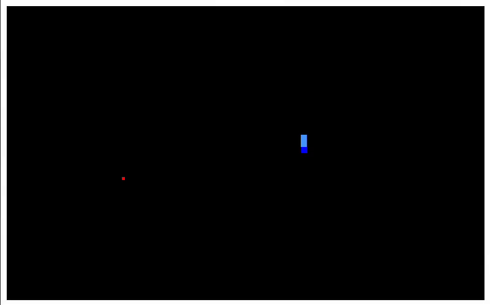

# Snake Game

A classic Snake Game made with PyGame



## What is Snake?

Snake is a **retro arcade game** where the player controls a **growing snake** that moves around the screen. The goal is to **eat food items**, which increase the snake’s length, while avoiding **collisions with walls and itself**. The challenge increases as the snake gets longer, requiring **quick reflexes and strategy** to survive. Snake is widely used as an **introductory project for game development** in programming.  

## How to Use

### Install dependencies

```bash
$> apt install python3
```
```bash
$> python3 -m pip install pygame
```

### Run

```bash
$> python3 src/snake.py
```

### Controls

| Hotkey | Control |
|--|--|
| Escape | Stop the game |
| Arrow Up | Move Up |
| Arrow Down | Move Down |
| Arrow Left | Move Left |
| Arrow Right | Move Right |
